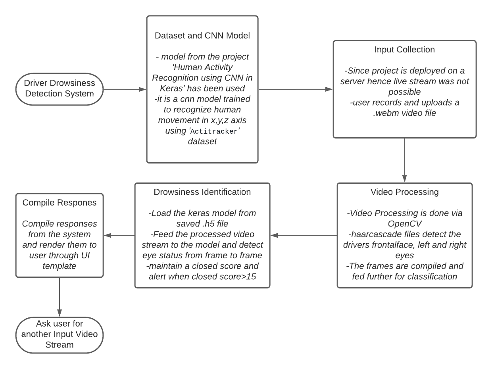
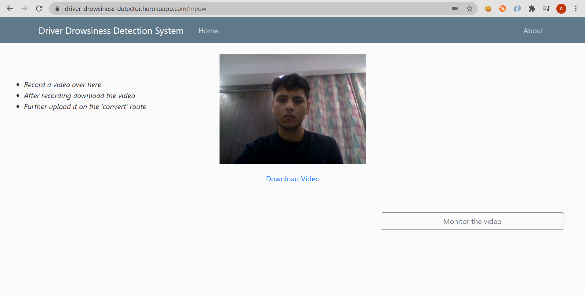
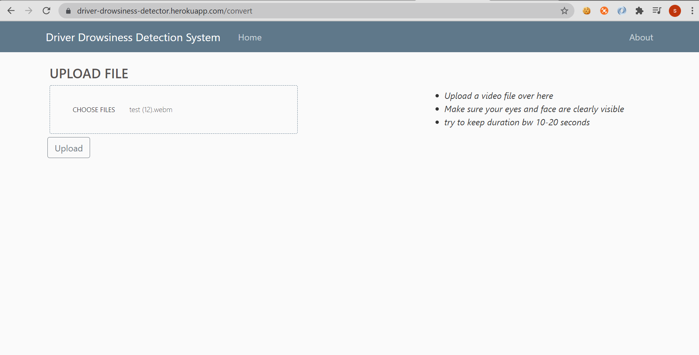
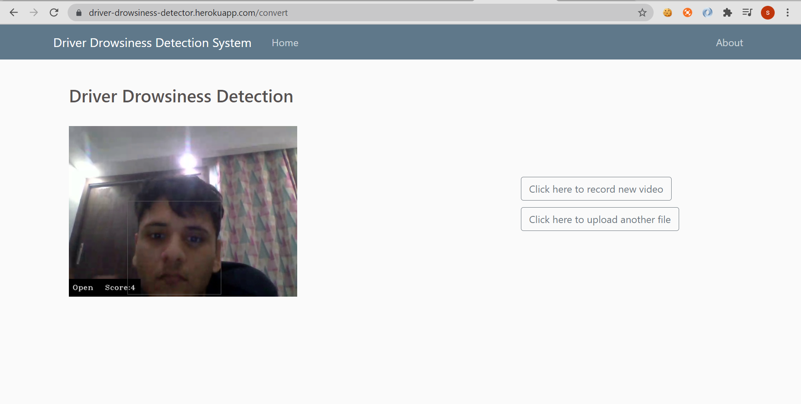

# Driver Drowsiness Detection System
This webpage illustrates the application of Video Stream Processing and Neural Networks.
The user has to record and upload a video stream and application return a monitored video stream. 
The web application has been deployed using heroku and is available at  
https://driver-drowsiness-detector.herokuapp.com/
## Description
The project basically aims to provide a drowsiness detection system for vehicle drivers. 
Video preprocessing of the input video stream has been done using OpenCV Library. 
Convolutional neural network has been used as the predicting model built using tf-keras library. 
And 'cascade' files have been used as to extract different profiles of the user 

## Flowchart Of Methodology

 
 
## I/O screenshots
### Input

 

 

### Output

## Authors
Suryansh Bhardwaj

## License
[MIT](https://choosealicense.com/licenses/mit/)

